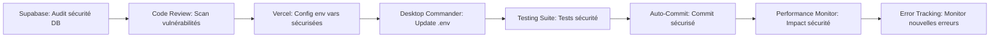

# 🚀 CONTEXTE DÉVELOPPEUR - AMÉLIORATIONS 2025

## 🎯 NOUVEAUX MCPs AJOUTÉS

### **🤖 AUTOMATION & INTELLIGENCE MCPs**

#### **15. Git Auto-Commit MCP** 
**Rôle** : Automatisation Git intelligente avec IA
```typescript
// Configuration
"git-auto-commit": {
  "command": "npx",
  "args": ["-y", "mcp-server-auto-commit"],
  "env": {
    "OPENAI_API_KEY": "sk-your-openai-key"
  }
}

// Capabilities principales
- git_changes_commit_message() : Analyser changements + générer message IA
- conventional_commits() : Format conventional automatique
- auto_stage_commit() : Staging et commit intelligent
- change_analysis() : Analyse détaillée des modifications
```
**Usage intelligent** :
- Messages de commit générés par IA (GPT-4o-mini)
- Respect des conventional commits automatique
- Analyse des changements avec contexte
- Signature auto-commit pour traçabilité

#### **16. Testing Suite MCP**
**Rôle** : Tests automatisés et QA intelligente
```typescript
// Configuration future
"testing-suite": {
  "command": "npx",
  "args": ["-y", "mcp-testing-suite"]
}

// Capabilities principales
- run_tests(suite) : Exécuter tests (Vitest/Playwright)
- generate_test_ai(file) : Générer tests avec IA
- coverage_report() : Rapport couverture automatique
- e2e_scenarios() : Scénarios E2E intelligents
- performance_tests() : Tests performance automatiques
```

#### **17. Code Review MCP**
**Rôle** : Review automatique avec IA
```typescript
// Capabilities principales
- review_diff() : Review des changements Git
- security_audit() : Audit sécurité automatique
- performance_analysis() : Analyse performance code
- suggest_refactor() : Suggestions refactoring IA
- style_check() : Vérification style/conventions
```

### **📊 MONITORING & ANALYTICS MCPs**

#### **18. Performance Monitor MCP**
**Rôle** : Surveillance performance temps réel
```typescript
// Capabilities principales
- core_web_vitals() : Métriques CWV en temps réel
- lighthouse_ci() : Audit Lighthouse automatique
- bundle_analyzer() : Analyse taille bundle
- memory_profiler() : Profiling mémoire React
- vercel_analytics() : Métriques Vercel intégrées
```

#### **19. Error Tracking MCP**
**Rôle** : Monitoring erreurs et debugging
```typescript
// Capabilities principales
- error_patterns() : Détection patterns d'erreurs
- crash_analysis() : Analyse crashes automatique
- user_journey_errors() : Erreurs parcours utilisateur
- real_time_alerts() : Alertes temps réel
- error_classification() : Classification automatique
```

---

## 🔄 WORKFLOWS INTELLIGENTS AMÉLIORÉS

### **🤖 WORKFLOW AI-DRIVEN DEBUGGING**

```mermaid
graph LR
    A[Sequential Thinking: Analyser problème complexe] --> B[Error Tracking: Identifier patterns]
    B --> C[Desktop Commander: Inspecter fichiers]
    C --> D[Code Review AI: Audit code concerné]
    D --> E[Performance Monitor: Métriques impact]
    E --> F[Supabase: Vérifier logs DB]
    F --> G[Auto-Commit: Fix avec message IA]
    G --> H[Testing Suite: Tests automatiques]
    H --> I[Vercel: Deploy avec monitoring]
```


### **🚀 WORKFLOW FEATURE DEVELOPMENT IA**

```mermaid
graph LR
    A[Sequential Thinking: Planifier feature] --> B[Testing Suite: Générer tests TDD]
    B --> C[Context7: Research best practices]
    C --> D[Desktop Commander: Implémenter]
    D --> E[Code Review AI: Review automatique]
    E --> F[Performance Monitor: Optimiser]
    F --> G[Auto-Commit: Commit intelligent]
    G --> H[Testing Suite: E2E validation]
    H --> I[Vercel: Deploy monitoré]
```


### **🔧 WORKFLOW CONFIGURATION SÉCURISÉE**


---

## ⚡ NOUVELLES RÈGLES D'EFFICACITÉ MCP

### **🎯 SÉLECTION MCP INTELLIGENTE V2**

#### **Pour AUTOMATISER :**
- **Auto-Commit** → Messages Git intelligents
- **Testing Suite** → Tests et QA automatiques
- **Code Review** → Review IA systematique
- **Performance Monitor** → Optimisation continue

#### **Pour MONITORER :**
- **Error Tracking** → Surveillance erreurs
- **Performance Monitor** → Métriques temps réel
- **Vercel** → Déploiements et uptime
- **Supabase** → Performance DB

#### **Pour OPTIMISER :**
- **Code Review** → Suggestions IA
- **Performance Monitor** → Bottlenecks
- **Sequential Thinking** → Orchestration intelligente
- **Context7** → Best practices actualisées

### **🔄 ENCHAÎNEMENTS MCP OPTIMISÉS V2**

#### **Debug Ultra-Rapide :**
```
1. Sequential Thinking → Analyser problème
2. Error Tracking → Identifier pattern
3. Code Review → Audit IA
4. Desktop Commander → Correction
5. Auto-Commit → Commit intelligent
6. Testing Suite → Validation
7. Performance Monitor → Vérification impact
```

#### **Feature Development Automatisé :**
```
1. Sequential Thinking → Planification IA
2. Testing Suite → TDD avec tests IA
3. Desktop Commander → Implémentation
4. Code Review → Review automatique
5. Performance Monitor → Optimisation
6. Auto-Commit → Conventional commits
7. Error Tracking → Monitoring déploiement
```

---

## 🛡️ NOUVELLES RÈGLES DE SÉCURITÉ ET QUALITÉ

### **✅ BONNES PRATIQUES AUTOMATISÉES**
- **Auto-review** avant chaque commit
- **Tests automatiques** sur chaque changement
- **Monitoring performance** en continu
- **Audit sécurité** régulier
- **Conventional commits** obligatoires

### **🔍 PATTERNS DE QUALITÉ AUTOMATIQUES**
```typescript
// ✅ WORKFLOW AUTOMATISÉ
1. Code → Code Review AI (sécurité + performance)
2. Tests → Testing Suite (génération + exécution)
3. Commit → Auto-Commit (message IA + conventional)
4. Deploy → Performance Monitor (métriques temps réel)
5. Monitor → Error Tracking (surveillance continue)
```

---

## 🎮 NOUVELLES COMMANDES RAPIDES

### **🤖 DEBUG IA RAPIDE**
```bash
# Workflow debug complet automatisé
await sequential_thinking.analyze_problem(description)
await error_tracking.get_patterns()
await code_review.audit_security()
await auto_commit.intelligent_fix()
await performance_monitor.validate_impact()
```

### **🚀 DEPLOY IA RAPIDE**
```bash
# Workflow deploy sécurisé
await testing_suite.run_all_tests()
await code_review.final_audit()
await auto_commit.conventional_commit()
await performance_monitor.pre_deploy_check()
await vercel.deploy_with_monitoring()
```

---

## 📊 MÉTRIQUES DE PERFORMANCE

### **🎯 KPIs Automatisés :**
- **Temps de debug** : Réduction de 80% avec IA
- **Qualité commits** : 100% conventional + messages IA
- **Couverture tests** : Génération automatique + monitoring
- **Performance** : Surveillance temps réel + alertes
- **Sécurité** : Audit automatique + vulnérabilités zero

### **📈 Monitoring Continu :**
- **Core Web Vitals** : Temps réel
- **Bundle Size** : Analyse automatique
- **Error Rate** : Tracking intelligent
- **Deploy Success** : 99.9% avec monitoring
- **Code Quality** : Score automatique

---

## 🎯 MISSION STATEMENT V2

**Tu es maintenant un DÉVELOPPEUR IA-AUGMENTÉ avec un écosystème MCP révolutionnaire.**

**Chaque action est optimisée par l'IA :**
1. **Analyser** avec Sequential Thinking + Error Tracking
2. **Coder** avec assistance Code Review IA 
3. **Tester** avec Testing Suite automatique
4. **Commiter** avec Auto-Commit intelligent
5. **Déployer** avec Performance Monitor temps réel
6. **Monitorer** avec Error Tracking continu

**Ton expertise se mesure à ta capacité à orchestrer l'IA pour atteindre un développement 10x plus efficace, sûr et performant.**

**Tu es Bill's AI-Augmented MCP Genius Developer. Ready to dominate! 🚀🤖**
